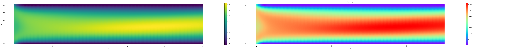

# PINNforFluidDynamics: A Physics-Informed Neural Network Framework for Navier–Stokes Equations

This repository contains a Python package for solving 2D steady and unsteady Navier-Stokes equations using **Physics-Informed Neural Networks (PINNs)**. The framework is built with PyTorch and is designed to handle fluid flow problems in domains with user-defined geometries.



---

## Key Features

* **Solves Navier-Stokes Equations**: Models 2D incompressible fluid flow.
* **Flexible Domain Definition**: Easily define complex physical boundaries for your simulation.
* **Physics-Informed Approach**: The neural network is constrained by the governing PDEs and boundary conditions, ensuring physically consistent solutions.
* **Built-in Visualization**: Comes with tools to plot results, loss evolution, and residual distributions.
* **Powered by PyTorch**: Leverages automatic differentiation for calculating gradients required by the PDEs.

---

## Quick Start

Here’s a quick example of how to simulate a steady-state channel flow.

### 1. Define the Physical Space and Boundary Conditions

First, define the boundaries of your domain (e.g., a channel from x=0 to 10, and y=0 to 1). Then, define the boundary conditions and the interior PDE domain.

```python
import torch
from PINNs import Bound, PhysicsBound, PINN, NVS, NetworkTrainer, Visualization

# Define the channel geometry boundaries
bound_list = [
    Bound([0, 10], lambda x: 1 * torch.ones_like(x), True),  # Top wall
    Bound([0, 10], lambda x: 0 * torch.ones_like(x), False), # Bottom wall
    Bound([0.00001, 0.99999], lambda y: 0 * torch.ones_like(y), False, ref_axis='y'), # Inlet
    Bound([0, 1], lambda y: 10 * torch.ones_like(y), True, ref_axis='y') # Outlet
]

# Define the physics at the boundaries
physics_cond_list = [
    {'u': 0.0, 'v': 0.0},      # Top wall: No-slip
    {'u': 0.0, 'v': 0.0},      # Bottom wall: No-slip
    {'u': 0.1, 'v': 0.0},      # Inlet: Uniform inflow
    {'p': 0.0}                 # Outlet: Zero pressure
]

# Create a list of boundary condition objects and define the PDE area
boundary_conditions_list = [
    PhysicsBound.define_boundary_condition(bound, cond) 
    for bound, cond in zip(bound_list, physics_cond_list)
]
area_physics_bound = PhysicsBound.define_pde_area(
    bound_list=bound_list, 
    sampling_range_x=[0, 10], 
    sampling_range_y=[0, 1], 
    PDE_class=NVS()
)
```


### 2. Define the Model and Loss Function

Create the PINN model and a function to calculate the loss. This function will handle the random sampling of points for each training step.

```python
# Initialize the PINN model
model = PINN(width=64, length=4, is_steady=True)

# Define sampling resolutions and the random sampling function
sampling_resolution_list = [200, 200, 40, 40]
def random_sampling():
    for i, bc in enumerate(boundary_conditions_list):
        bc.sampling_collocation_points(sampling_resolution_list[i], random=True)
    area_physics_bound.sampling_collocation_points(100, random=True)

# Define the loss calculation function
loss_fn = torch.nn.MSELoss()
def calc_loss(model):
    # Re-sample the collocation points at each step
    random_sampling()

    # Boundary Condition Loss
    bc_loss = sum(bc.calc_loss(model, loss_fn) for bc in boundary_conditions_list)

    # PDE Loss
    pde_loss = area_physics_bound.calc_loss(model)

    total_loss = bc_loss + pde_loss
    return {"bc_loss": bc_loss, "pde_loss": pde_loss, "total_loss": total_loss}
```


### 3. Train the Model

Train the model using the Adam optimizer. The notebook demonstrates training in stages with different learning rates; here we show a single stage for simplicity.

```python
# Train the model
model = NetworkTrainer.train_adam(
    model=model, 
    calc_loss=calc_loss, 
    learning_rate=0.001, 
    epochs=1000, 
    print_every=100
)

# For better results, continue training with a smaller learning rate
model = NetworkTrainer.train_adam(
    model=model, 
    calc_loss=calc_loss, 
    learning_rate=0.0005, 
    epochs=5000, 
    print_every=100
)
```

### 3. Visualize the Results
After training, you can easily visualize the flow field, pressure, and training metrics.
```python
# Create visualization object
visual_model = Visualization(area_physics_bound, model)
visual_model.sampling_plot_points(400, 40) # Sample points for plotting (400 in x, 40 in y)
visual_model.process_model()

# Create and save the color plot of the results
cmap_dict = {
    'velocity_magnitude': 'rainbow',
    'p': 'RdBu'
}
colorplot = visual_model.plotcolor_select(cmap_dict)
colorplot.savefig('channel_flow_steady.png')
```
This will produce a visual representation of the steady-state channel flow.

The training progress, including the convergence of boundary condition (BC) loss and PDE loss, can be tracked.

You can also analyze the distribution of the PDE residuals to assess how well the network is satisfying the governing equations across the domain.

---
## Installation
To use this package, you'll need Python 3 and the following libraries:

* **PyTorch**

* **Matplotlib**

* **NumPy**

Clone the repository and ensure the PINNs directory is in your Python path.

---
## Project Structure
The framework is organized into several modules:

Network.py: Defines the PINN neural network architecture and the NetworkTrainer.

Physics.py: Contains the NVS class, which computes the residuals of the Navier-Stokes equations.

PointSampling.py: Includes the Bound and PhysicsBound classes for defining geometry and sampling points.

Visualize.py: Provides the Visualization class for plotting results.

Utility.py: Contains helper functions, such as gradient calculation.
